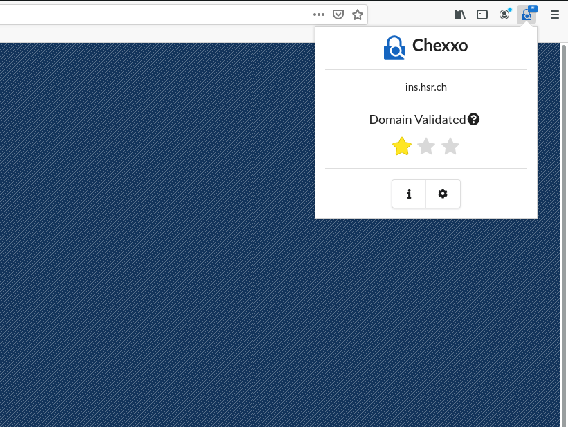
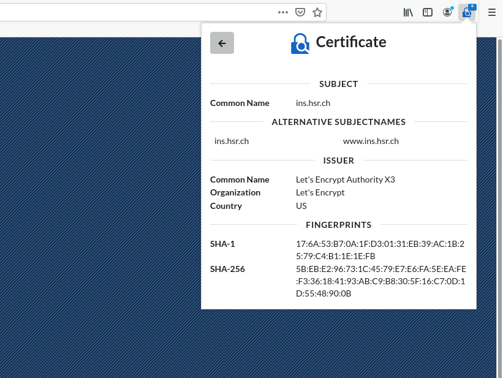

# Chexxo
Chexxo is a browser extension which enables it's user to identify the quality of the TLS-Certificate which is used to secure the connection between himself and the website he is visiting.

The extension differentiates three types of qualities as defined by the CA/Browser Forum. Those are in ascending order by quality `domain validated`, `organization validated` and `extended validated`. More information regarding those quality types can be found below.

If the quality of a certificate decreases this is a strong indicated that something fishy is going on which is why we developed this extension in order to allow users to react to such a change.

## Features
- The certificate quality according to the ones specified by CA/Browser Forum is made visibile by the extension.
- Details of the certificate can be shown by navigating to the certificate view inside the extension.
- The extension blocks requests to domains from which the quality has decreased. This blocking behaviour can be activated and deactivated in the extension settings.

## Screenshots
### Quality view

### Certificate view

### Certificate qualities

### Blocked view 

### Settings Firefox 

### Settings Chromium 

## Certificate Qualities
### Domain validated
If a server maintainer wants to gain a `domain validated` certificate all he has to do is prove that he owns the domain. This may be done by some sort of [challenge](https://letsencrypt.org/docs/challenge-types/). The best known provider of such certificates is `Let's Encrypt`. This type of certificate is also the one most used in phishing and malware attacks. Almost all such attacks use this certficate type.

### Organization validated
In order to gain a certificate with the quality `organization validated` a server maintainer has to prove that he has the right to obtain such a certificate in the name of the company he claims to belong to. The certificate authority which creates the certificate will verify that the information regarding the company is correct. Additional verified company information is included into the certificate.

### Extended validated
The `extended validated` is the most secure and also expensive type of certificate. This type is mostly used by the certificate providers themselves and companys which handle private information like banks. Applicants for such a certificate have to provide extensive information about the company they are representing which will then be verified very thouroughly. More information about the validation process can be found [here](https://cabforum.org/about-ev-ssl/).

## Support
The extension logs all errors which occur. Those may then be exported in the settings page of the extension. If you have a problem please open a issue and provide us with the appropriate logs which document the error you experienced.

## For developers
### Contributions
Contributions are more than welcome but, please contact a maintainer before working on a contribution so that we may give feedback if such a contribution is within the scope we want this extension to be in.

In terms of coding rules please use the tooling provided and make sure `prettier` as well as `eslint` do not report any problems. Also all tests have to pass. Please provide proper tests for all your contributions. Also please write the needed typedoc comments as it will make maintenance much easier in the future.

### Tooling
The following tools are used for developing this extension:

- **Typescript** as language
- **React** as GUI-Framework
- **Eslint** for linting and finding problems like unused variables or long methods.
- **Prettier** for formating
- **Webpack** for packaging
- **Jest** for testing
- **Typedoc(TsDoc)** for documentation

### Versioning
Version names consist of a Character name for Major versions and a power-up name for minor versions. Those are both taken from the Mario universe.
